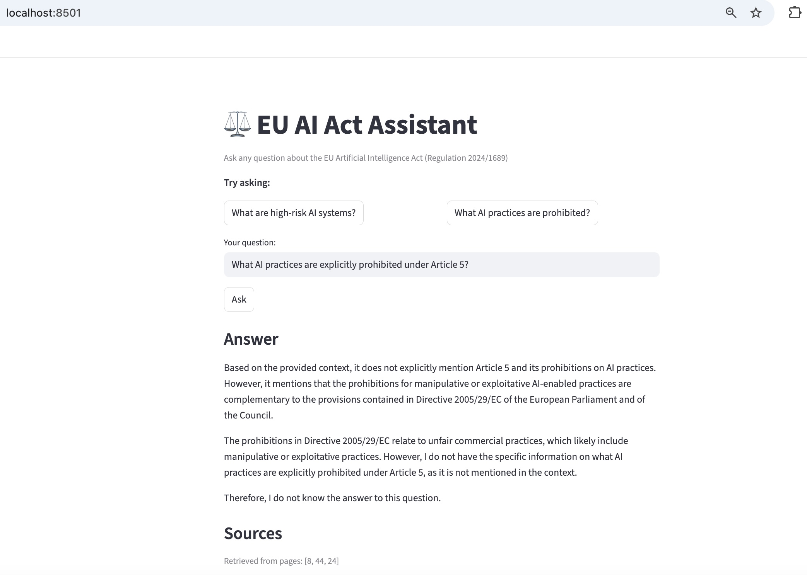

# ⚖️ EU AI Act Assistant — RAG System

> **Forked from [ray-project/llm-applications](https://github.com/ray-project/llm-applications)**  
> Original project by the Anyscale/Ray team. This fork adapts the architecture 
> to run locally without Ray cluster infrastructure, and adds three improvements 
> on top of their baseline: hybrid search, cross-encoder reranking, and query expansion.

A production-style Retrieval-Augmented Generation (RAG) system for querying 
the EU Artificial Intelligence Act (Regulation 2024/1689) in natural language.

The EU AI Act is the world's first comprehensive AI regulation (effective August 2024). 
Every company deploying AI in the EU must understand their compliance obligations. 
This system makes the 459-page regulation queryable — directly relevant for 
German companies navigating compliance requirements.

**Official EU AI Act document:** [EUR-Lex — Regulation (EU) 2024/1689](https://eur-lex.europa.eu/legal-content/EN/TXT/?uri=CELEX:32024R1689)

## Demo



Ask questions like:
- "What AI practices are explicitly prohibited under Article 5?"
- "What obligations do providers of high-risk AI systems have?"
- "What does Article 13 require for transparency?"

## Architecture

**Pipeline flow:**

1. **Load** — PyMuPDF reads the EU AI Act PDF page by page
2. **Chunk** — RecursiveCharacterTextSplitter splits into 300-token chunks with 50-token overlap
3. **Embed** — all-MiniLM-L6-v2 converts each chunk into a 384-dimensional vector
4. **Index** — vectors stored in FAISS (dense) + tokenized text stored in BM25 (sparse)
5. **Query expansion** — Groq LLM rewrites the user query with legal terminology
6. **Hybrid retrieve** — FAISS semantic search (top-10) + BM25 keyword search (top-10) combined with Reciprocal Rank Fusion, merged into top-20 candidates
7. **Rerank** — Flashrank cross-encoder rescores top-20 candidates, returns top-3
8. **Generate** — Llama 3.1 8B via Groq produces answer grounded in retrieved context
9. **Serve** — FastAPI REST endpoint + Streamlit UI

## My Improvements Over the Ray Baseline

| Improvement | Reason |
|---|---|
| Stripped Ray cluster dependency | Runs locally, no infrastructure cost |
| Hybrid BM25 + FAISS with RRF | BM25 catches exact legal terms (e.g. "Article 5") that semantic search misses |
| Cross-encoder reranking (Flashrank) | Re-scores top-20 candidates jointly with query — more accurate than cosine similarity alone |
| LLM query expansion | Enriches queries with legal terminology before retrieval |

## Chunk Size Experiment

Systematic experiment across 4 chunk sizes on the EU AI Act:

| Chunk size | Total chunks | Result |
|---|---|---|
| 200 | 4736 | Failed — chunks too small, context destroyed |
| 300 | 2544 | Best — correct article references, minimal hallucination |
| 500 | 1398 | Partial — missed definitions, honest "I don't know" responses |
| 1000 | 707 | Worst — hallucinated a definition of high-risk AI |

**Key finding:** 300 tokens worked best for this legal document.
Larger chunks caused the LLM to hallucinate plausible-sounding but 
incorrect legal definitions. Smaller chunks lost the context needed 
to answer definitional questions.

## Key Technical Findings

**What improved with hybrid search + reranking:**
- Prohibited AI practices (Article 5) — correctly retrieved and cited
- Provider obligations (Article 16) — structured list with article references
- Transparency requirements (Article 13) — correct page range found

**Remaining challenge:**
- Definitions spread across Annex I and Annex III require multi-chunk 
  synthesis — a single retrieval step cannot capture distributed information.
  Next step: metadata-aware retrieval that understands document structure.

**Query expansion failure mode discovered:**
- LLM hallucinated article numbers in expanded queries, degrading retrieval.
- Fix: constrained expansion prompt to legal terminology only, 
  preserving explicit article numbers from the original query.

## Tech Stack

| Component | Tool |
|---|---|
| Document loading | PyMuPDF (LangChain) |
| Chunking | RecursiveCharacterTextSplitter |
| Embeddings | all-MiniLM-L6-v2 (HuggingFace) |
| Dense retrieval | FAISS |
| Lexical retrieval | BM25 (rank_bm25) |
| Fusion | Reciprocal Rank Fusion |
| Reranking | Flashrank (ms-marco-MiniLM-L-12-v2) |
| LLM | Llama 3.1 8B via Groq (free) |
| API serving | FastAPI + Uvicorn |
| UI | Streamlit |
| Orchestration | LangChain |
| Containerization | Docker + Docker Compose |

## How to Run

```bash
# 1. Clone this repo
git clone https://github.com/xinqiaoYang/llm-applications
cd llm-applications/my_rag

# 2. Download the EU AI Act PDF
# Official source: https://eur-lex.europa.eu/legal-content/EN/TXT/PDF/?uri=CELEX:32024R1689
# Save as: eu_ai_act.pdf in this folder

# 3. Get a free Groq API key at https://console.groq.com
```

## Running with Docker (recommended)

```bash
export GROQ_API_KEY="your_key_here"
docker-compose up --build

# API docs: http://localhost:8000/docs
# Streamlit UI: http://localhost:8501
```

## Running locally

```bash
python3 -m venv venv
source venv/bin/activate
pip install -r requirements.txt
export GROQ_API_KEY="your_key_here"

# Run API (terminal 1)
uvicorn api:app --reload

# Run UI (terminal 2)
streamlit run app.py
```

## Project Files

| File | Purpose |
|---|---|
| `rag.py` | Basic LangChain RAG pipeline |
| `experiment.py` | Chunk size experiment (200/300/500/1000) |
| `improved_rag.py` | Full pipeline: hybrid search + reranking + query expansion |
| `api.py` | FastAPI REST endpoint |
| `app.py` | Streamlit UI |
| `Dockerfile` | Container definition |
| `docker-compose.yml` | Multi-service orchestration (API + UI) |
